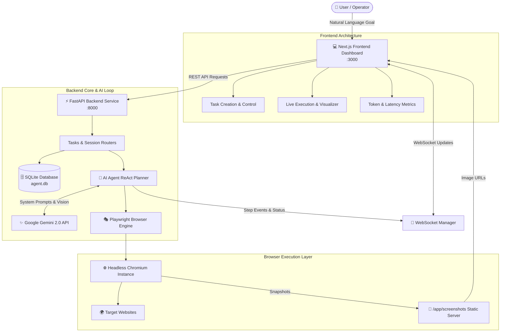

# 🤖 AI Browser Agent

[](https://fastapi.tiangolo.com)
[](https://nextjs.org/)
[](https://playwright.dev/)
[](https://aistudio.google.com/)
[](https://www.docker.com/)
[](https://opensource.org/licenses/MIT)

> An autonomous AI-powered browser automation agent that translates natural language goals into intelligent browser actions, navigates complex dynamic web applications, extracts structured data, and streams live visual execution directly to an interactive Next.js dashboard.

---

## 🌟 Key Features

- 🧠 **Autonomous AI Planning (ReAct Loop):** Breaks down complex user requests into dynamic step-by-step browser interactions with error recovery and goal validation powered by Google Gemini.
- 🎭 **Resilient Playwright Automation:** Smart multi-tiered element selectors (text, CSS, aria-label, XPath), auto-scrolls, form filling, and dynamic page state waits.
- ⚡ **Real-Time WebSocket Streaming:** Low-latency live execution timeline, step metrics, token usage tracking, and base64 screenshot feeds.
- 📊 **Modern Glassmorphic Dashboard:** Built with Next.js 15 & Tailwind CSS, featuring task creation, timeline replays, tabular data exports, and approval gates for sensitive actions.
- 🐳 **1-Command Docker Deployment:** Multi-container orchestration for FastAPI, Next.js, and headless Chromium with pre-installed Linux system graphics libraries.
- 💾 **Instant Demo Seeding:** Built-in seed data script creating realistic job searches, e-commerce price comparisons, and news scrapers with zero setup.

---

## 🏗️ Architecture



---

## 📋 API Specifications & Contracts

### REST Endpoints (`http://localhost:8000/api/v1`)

| Method | Endpoint | Description |
| :--- | :--- | :--- |
| `POST` | `/api/v1/tasks` | Create a new automation task with goal & configuration |
| `GET` | `/api/v1/tasks` | List all historical and active automation tasks |
| `GET` | `/api/v1/tasks/{id}` | Get full task details including step timeline and results |
| `POST` | `/api/v1/tasks/{id}/execute` | Start executing task via AI Planner and Browser Engine |
| `POST` | `/api/v1/tasks/{id}/cancel` | Gracefully cancel a running task |
| `GET` | `/api/v1/tasks/{id}/screenshots` | Retrieve all captured screenshots for a task |
| `POST` | `/api/v1/browser/sessions` | Spawn a dedicated Playwright browser session |
| `GET` | `/api/v1/browser/sessions/{id}` | Check browser session status and active page |
| `DELETE`| `/api/v1/browser/sessions/{id}` | Terminate and clean up browser session |
| `GET` | `/health` | Backend and database health status |

### WebSocket Endpoint (`ws://localhost:8000/api/v1/ws/tasks/{id}`)
Streams `ExecutionUpdate` payloads:
- `step_started`: Broadcasted when an action starts.
- `step_completed`: Broadcasted when action completes with screenshot.
- `step_failed`: Emitted on error with recovery details.
- `task_completed`: Final payload with structured output.

---

## 🚀 Quick Start Guide

### Option 1: Docker Compose (Recommended)

1. **Clone the repository:**
   ```bash
   git clone https://github.com/nothingmuch18/ai-browser-agent.git
   cd ai-browser-agent
   ```

2. **Configure your API Key:**
   ```bash
   cp .env.example .env
   ```
   Edit `.env` and insert your [Google Gemini API Key](https://aistudio.google.com/apikey):
   ```env
   GEMINI_API_KEY=AIzaSy...
   ```

3. **Start the entire application:**
   ```bash
   docker compose up --build
   ```

4. **Access the Application:**
   - **Frontend Dashboard:** [http://localhost:3000](http://localhost:3000)
   - **Backend OpenAPI Docs:** [http://localhost:8000/docs](http://localhost:8000/docs)
   - **Backend Healthcheck:** [http://localhost:8000/health](http://localhost:8000/health)

---

### Option 2: Local Development Setup

#### 1. Automated Setup Script
- **macOS / Linux:**
  ```bash
  chmod +x scripts/setup.sh
  ./scripts/setup.sh
  ```
- **Windows PowerShell:**
  ```powershell
  .\scripts\setup.ps1
  ```

#### 2. Manual Setup
```bash
# 1. Backend Setup
cd backend
python -m venv venv
source venv/bin/activate   # On Windows: .\venv\Scripts\activate
pip install -r requirements.txt
playwright install chromium

# 2. Seed Demo Data (Optional)
python ../scripts/seed_data.py

# 3. Start Backend
uvicorn app.main:app --reload --port 8000

# 4. Frontend Setup (in a new terminal)
cd frontend
npm install
npm run dev
```

---

## 📁 Repository Structure

```
ai-browser-agent/
├── .github/
│   └── workflows/
│       └── ci.yml               # GitHub Actions CI pipeline (lint, test, build)
├── backend/
│   ├── app/
│   │   ├── __init__.py
│   │   ├── main.py              # FastAPI application & WebSocket server
│   │   ├── config.py            # Pydantic settings & env variables
│   │   ├── models.py            # Shared Pydantic schemas & SQLAlchemy models
│   │   ├── database.py          # SQLite connection and session maker
│   │   ├── routers/
│   │   │   ├── tasks.py         # Task CRUD & execution trigger endpoints
│   │   │   ├── browser.py       # Browser session lifecycle endpoints
│   │   │   └── auth.py          # Authentication routes
│   │   ├── services/
│   │   │   ├── ai_agent.py      # Gemini AI ReAct planner & loop
│   │   │   ├── browser_engine.py# Playwright automation engine
│   │   │   ├── memory.py        # Task context memory
│   │   │   └── extractor.py     # HTML/DOM structured data extractor
│   │   └── utils/
│   │       └── prompts.py       # System and agent prompts
│   ├── tests/
│   │   ├── conftest.py          # Pytest fixtures & isolated test app
│   │   └── test_integration.py # Integration test suite
│   ├── Dockerfile               # Production Python 3.11 + Playwright image
│   └── requirements.txt         # Backend dependencies
├── frontend/
│   ├── src/
│   │   ├── app/
│   │   │   ├── layout.tsx       # Root layout & navbar
│   │   │   ├── page.tsx         # Dashboard overview & quick actions
│   │   │   ├── tasks/page.tsx   # Task history & detailed inspection
│   │   │   └── execute/page.tsx # Live execution visualizer & stream
│   │   ├── components/
│   │   │   ├── Navbar.tsx
│   │   │   ├── TaskCard.tsx
│   │   │   ├── ExecutionTimeline.tsx
│   │   │   ├── BrowserView.tsx
│   │   │   ├── MetricsPanel.tsx
│   │   │   └── ApprovalDialog.tsx
│   │   └── lib/
│   │       └── api.ts           # Axios / Fetch client & WebSocket hooks
│   ├── Dockerfile               # Node.js 20 Next.js container image
│   └── package.json
├── scripts/
│   ├── setup.sh                 # Unix environment installer
│   ├── setup.ps1                # Windows PowerShell environment installer
│   ├── seed_data.py             # SQLite demo database generator
│   ├── merge_branches.sh        # Unix team branch merger
│   └── merge_branches.ps1       # Windows team branch merger
├── .env.example                 # Environment variables template
├── .gitignore                   # Git ignore patterns
├── docker-compose.yml           # Multi-container orchestration
└── README.md                    # Project documentation
```

---

## 🔀 Team Integration Workflow

At sprint checkpoints (**1:30** and **2:45**), Member D runs the merge helper to integrate team branches:

```bash
# Unix / macOS / Git Bash:
./scripts/merge_branches.sh

# Windows PowerShell:
.\scripts\merge_branches.ps1
```

### Integration Troubleshooting Matrix

| Issue | Root Cause | Solution |
| :--- | :--- | :--- |
| **CORS error on frontend** | Mismatched origin | Verify `CORS_ORIGINS=http://localhost:3000` in `.env` |
| **WebSocket disconnects** | Wrong port or path | Ensure frontend uses `ws://localhost:8000/api/v1/ws/tasks/{id}` |
| **Playwright crashes in Docker** | Missing Linux X11 libraries | Use `backend/Dockerfile` which includes all Chromium dependencies |
| **Gemini 403 / Quota error** | Invalid or missing API key | Check `GEMINI_API_KEY` in `.env` and verify key status at Google AI Studio |
| **Screenshots not displaying** | Directory not mounted | Ensure `screenshots:/app/screenshots` volume is mounted in Docker Compose |
| **Database locked error** | Concurrent SQLite writes | Ensure SQLite timeout is set to 30s in database connection string |

---

## 👥 Sprint Team & Roles

- 🔴 **Member A:** Backend, Gemini AI Agent & ReAct Loop (`member-a/backend-ai`)
- 🟢 **Member B:** Playwright Browser Engine & Data Extractor (`member-b/browser-engine`)
- 🔵 **Member C:** Next.js Frontend & Real-time Visualizer (`member-c/frontend`)
- 🟡 **Member D:** DevOps, Docker, Database Seeding, CI/CD & Integration Lead (`member-d/infra`)
